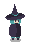
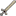
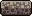
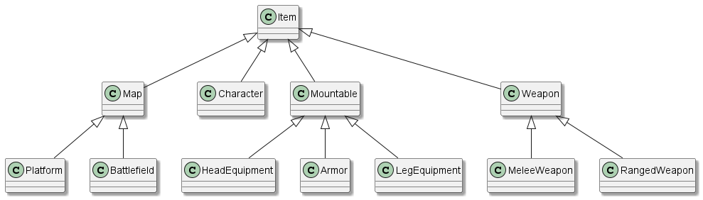
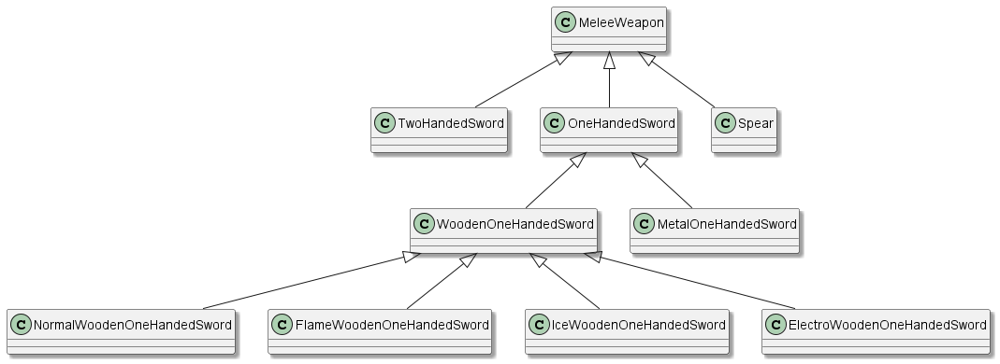
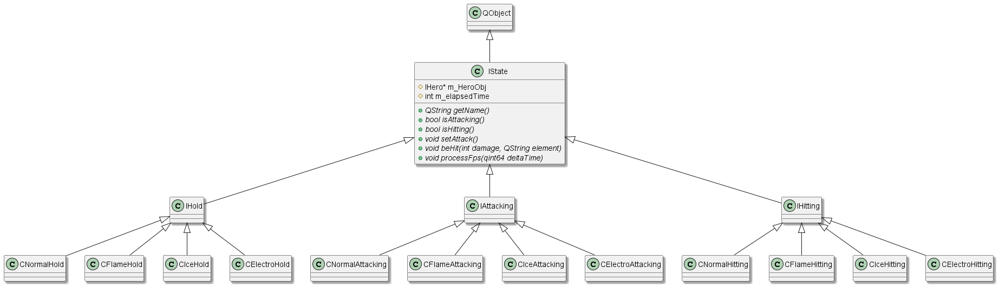
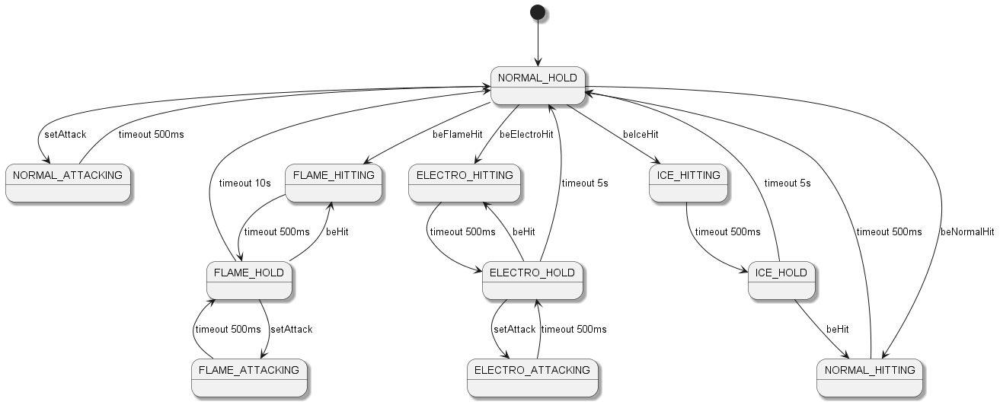
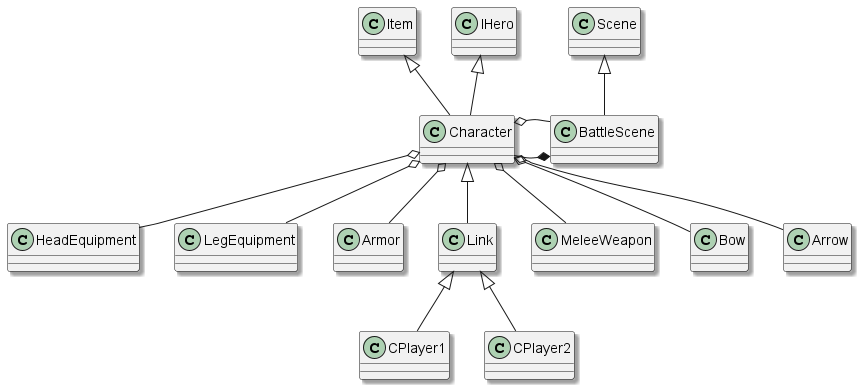

# 程序设计实训2024大作业：带有元素反应系统的2D横板动作游戏

- [程序设计实训2024大作业：带有元素反应系统的2D横板动作游戏](#程序设计实训2024大作业带有元素反应系统的2d横板动作游戏)
  - [1 游戏介绍](#1-游戏介绍)
    - [1.1 游戏背景](#11-游戏背景)
    - [1.2 游戏设定](#12-游戏设定)
      - [1.2.1 角色状态](#121-角色状态)
      - [1.2.2 装备](#122-装备)
      - [1.2.3 近战武器](#123-近战武器)
      - [1.2.4 远程武器](#124-远程武器)
      - [1.2.5 平台](#125-平台)
  - [2 如何编译运行](#2-如何编译运行)
  - [3 操作介绍](#3-操作介绍)
    - [3.1 玩家 1](#31-玩家-1)
    - [3.2 玩家 2](#32-玩家-2)
    - [3.3 其他操作](#33-其他操作)
  - [4 设计思路](#4-设计思路)
  - [5 模块之间逻辑关系](#5-模块之间逻辑关系)
  - [6 程序运行流程](#6-程序运行流程)
  - [7 功能需求完成情况](#7-功能需求完成情况)
    - [7.1 需求点1：基本移动和生命值](#71-需求点1基本移动和生命值)
    - [7.2 需求点2：多种地形](#72-需求点2多种地形)
    - [7.3 需求点3：生命值系统](#73-需求点3生命值系统)
    - [7.4 需求点4：物品掉落](#74-需求点4物品掉落)
    - [7.5 需求点5：近战武器](#75-需求点5近战武器)
    - [7.6 需求点6：弓和箭](#76-需求点6弓和箭)
    - [7.7 需求点7：火属性](#77-需求点7火属性)
    - [7.8 需求点8：冰属性](#78-需求点8冰属性)
    - [7.9 需求点9：电属性](#79-需求点9电属性)
    - [7.10 需求点10：多种盔甲](#710-需求点10多种盔甲)
    - [7.11 用户体验](#711-用户体验)
    - [7.12 可选需求点1：对战AI](#712-可选需求点1对战ai)
    - [7.13 可选需求点2：局域网联机](#713-可选需求点2局域网联机)
  - [8 参考文献](#8-参考文献)

## 1 游戏介绍

### 1.1 游戏背景

### 1.2 游戏设定

#### 1.2.1 角色状态

| 图片 | 说明 |
| --- | --- |
|  | 无装备 |
|  | 初始套装 |
|  | 受击 |
|  | 着火 |
|  | 冰冻 |
|  | 触电 |

#### 1.2.2 装备

| 图片 | 说明 |
| --- | --- |
|  | 普通帽子 |
|  | 火抗帽子 |
|  | 冰抗帽子 |
|  | 电抗帽子 |
|  |  |
|  | 普通巫师袍 |
|  | 火抗巫师袍 |
|  | 冰抗巫师袍 |
|  | 电抗巫师袍 |
|  |  |
|  | 普通鞋子 |
|  | 火抗鞋子 |
|  | 冰抗鞋子 |
|  | 电抗鞋子 |

#### 1.2.3 近战武器

| 图片 | 说明 | 图片 | 说明 |
| --- | --- | --- | --- |
|  | 单手剑_木质_普通 |  | 单手剑_金属质_普通 |
|  | 单手剑_木质_火 |  | 单手剑_金属质_火 |
|  | 单手剑_木质_冰 |  | 单手剑_金属质_冰 |
|  | 单手剑_木质_电 |  | 单手剑_金属质_电 |
|  |  |  |  |
|  | 双手剑_木质_普通 |  | 双手剑_金属质_普通 |
|  | 双手剑_木质_火 |  | 双手剑_金属质_火 |
|  | 双手剑_木质_冰 |  | 双手剑_金属质_冰 |
|  | 双手剑_木质_电 |  | 双手剑_金属质_电 |
|  |  |  |  |
|  | 长矛_木质_普通 |  | 长矛_金属质_普通 |
|  | 长矛_木质_火 |  | 长矛_金属质_火 |
|  | 长矛_木质_冰 |  | 长矛_金属质_冰 |
|  | 长矛_木质_电 |  | 长矛_金属质_电 |

#### 1.2.4 远程武器

| 图片 | 说明 | 图片 | 说明 |
| --- | --- | --- | --- |
|  | 初级法杖_木质 |  | 初级法杖_金属质 |
|  | 连击法杖_木质 |  | 连击法杖_金属质 |
|  | 群攻法杖_木质 |  | 群攻法杖_金属质 |
|  |  |
|  | 能量球_普通 |
|  | 能量球_火 |
|  | 能量球_冰 |
|  | 能量球_电 |

#### 1.2.5 平台

| 图片 | 说明 |
| --- | --- |
|  | 地块_岩石 |
|  | 地块_木质 |
|  | 地块_金属 |

## 2 如何编译运行

本项目使用 `Qt Creator` 构建，
开发环境为：

    Win11
    Qt Creator 13.0.2
    Qt 6.8.0

运行：

    1. 在 Qt Creator 中选择 CMakeLists 打开项目
    2. 选择 Qt 6.8.0 MinGW 64-bit 或其他构建套件进行配置
    3. 点击编译运行

## 3 操作介绍

### 3.1 玩家 1

`按键A`：向左移动

`按键D`：向右移动

`按键W`：跳跃

`按键J`：拾取

`按键K`：近战武器攻击 / 切换箭矢

`按键L`：远程武器攻击 / 扔出近战武器

`按键I`：切换武器

### 3.2 玩家 2

`按键Left`：向左移动

`按键Right`：向右移动

`按键Up`：跳跃

`按键Comma`：拾取

`按键Period`：近战武器攻击 / 切换箭矢

`按键Slash`：远程武器攻击 / 扔出近战武器

`按键Shift`：切换武器

### 3.3 其他操作

`按键Return`：打开作弊码输入框

## 4 设计思路

1. 充分使用面向对象编程的思想，对不同模块进行抽象与封装

2. 利用状态机实现玩家不同元素与行为之间的状态切换

## 5 模块之间逻辑关系

`MyGame` 继承自 `QMainWindow`，是游戏主页面

`Scene` 继承自 `QGraphicsScene`，是游戏战斗主页面。在其子类 `BattleScene` 中，处理场景内各 `Item` 的交互

`Item` 继承自 `QGraphicsItem`，主要处理物品的显示、位置与移动

游戏场景中各物品均为 `Item` 的子类，如下图所示

而某一元素某一材质的物品又为其大类的子类，下图以单手剑类为例（省略金属质子类）

`CItemFactory` 为 `Item` 工厂，处理各种物品的生成

`IState` 为玩家状态类，继承自 `QObject`，处理玩家的元素与行为状态。设计如下图所示

状态切换如下图所示： TODO：更新状态切换图

`Character` 为玩家类，处理玩家的相关操作，与其他类的关系如下图所示

## 6 程序运行流程

## 7 功能需求完成情况

### 7.1 需求点1：基本移动和生命值

### 7.2 需求点2：多种地形

### 7.3 需求点3：生命值系统

### 7.4 需求点4：物品掉落

### 7.5 需求点5：近战武器

### 7.6 需求点6：弓和箭

### 7.7 需求点7：火属性

### 7.8 需求点8：冰属性

### 7.9 需求点9：电属性

### 7.10 需求点10：多种盔甲

### 7.11 用户体验

### 7.12 可选需求点1：对战AI

### 7.13 可选需求点2：局域网联机

## 8 参考文献

> [1] Qt Documentation [EB/OL]，https://doc.qt.io
