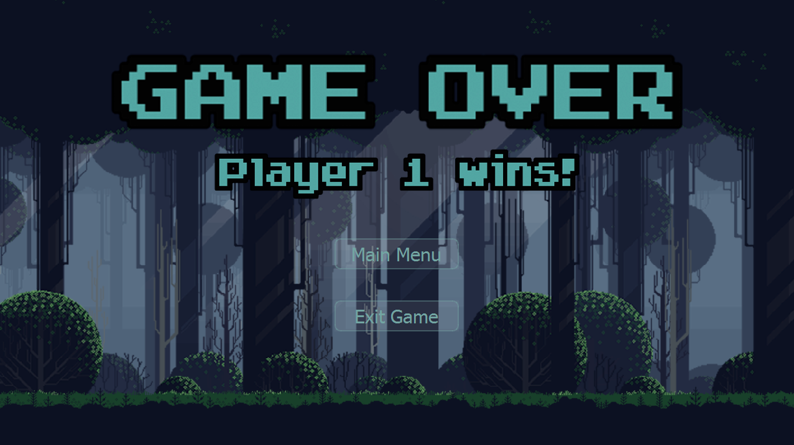
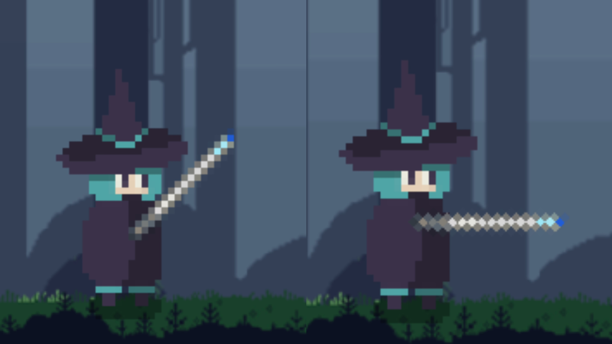
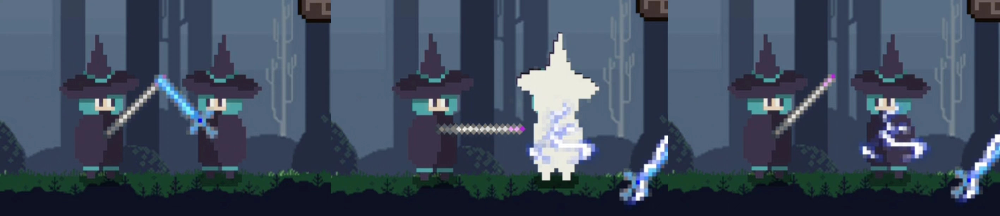

# The Journey of Wizard

程序设计实训2024大作业：带有元素反应系统的2D横板动作游戏


- [The Journey of Wizard](#the-journey-of-wizard)
  - [1 游戏介绍](#1-游戏介绍)
    - [1.1 游戏背景](#11-游戏背景)
    - [1.2 游戏设定](#12-游戏设定)
      - [1.2.1 角色状态](#121-角色状态)
      - [1.2.2 装备](#122-装备)
      - [1.2.3 近战武器](#123-近战武器)
      - [1.2.4 远程武器](#124-远程武器)
      - [1.2.5 平台](#125-平台)
  - [2 如何编译运行](#2-如何编译运行)
  - [3 操作介绍](#3-操作介绍)
    - [3.1 玩家 1](#31-玩家-1)
    - [3.2 玩家 2](#32-玩家-2)
    - [3.3 其他操作](#33-其他操作)
  - [4 设计思路](#4-设计思路)
  - [5 模块之间逻辑关系](#5-模块之间逻辑关系)
    - [5.1 `MyGame` 和 `Scene`](#51-mygame-和-scene)
    - [5.2 `Item`](#52-item)
    - [5.3 玩家状态机与 `Character`](#53-玩家状态机与-character)
    - [5.4 物品状态机](#54-物品状态机)
    - [5.5 对战AI状态机](#55-对战ai状态机)
  - [6 程序运行流程](#6-程序运行流程)
  - [7 功能需求完成情况](#7-功能需求完成情况)
    - [7.1 需求点1：基本移动和生命值](#71-需求点1基本移动和生命值)
    - [7.2 需求点2：多种地形](#72-需求点2多种地形)
    - [7.3 需求点3：生命值系统](#73-需求点3生命值系统)
    - [7.4 需求点4：物品掉落](#74-需求点4物品掉落)
    - [7.5 需求点5：近战武器](#75-需求点5近战武器)
    - [7.6 需求点6：弓和箭](#76-需求点6弓和箭)
    - [7.7 需求点7：火属性](#77-需求点7火属性)
    - [7.8 需求点8：冰属性](#78-需求点8冰属性)
    - [7.9 需求点9：电属性](#79-需求点9电属性)
    - [7.10 需求点10：多种盔甲](#710-需求点10多种盔甲)
    - [7.11 用户体验](#711-用户体验)
    - [7.12 可选需求点1：对战AI](#712-可选需求点1对战ai)
  - [8 参考文献](#8-参考文献)


## 1 游戏介绍

### 1.1 游戏背景

巫师姐妹中的姐姐在幼年时神秘失踪，仿佛被森林的雾气吞噬，徒留无尽的谜团和思念。

妹妹自幼便承受着失去姐姐的痛苦，将全部心血投入巫术修炼，誓言要找到姐姐的下落。她甚至远赴星系，向一位强大的绝地武士学习光剑技艺，希望借助多重力量解开失踪之谜。

一日，妹妹在古老卷轴中发现了一则传说：森林深处藏有一件宝物，能找到世界上任何一个人的位置。

她踏上征程。

森林中弥漫着神秘的低语，隐秘的咒语回荡在耳边。随着她一步步深入，光线渐暗，寒气逼近。妹妹握紧了手中的光剑和法杖。

一个与她一模一样的怪物悄然出现，仿佛早已在此等待……

### 1.2 游戏设定

#### 1.2.1 角色状态

| 图片 | 说明 |
| --- | --- |
|  | 无装备 |
|  | 初始套装 |
|  | 受击 |
|  | 着火 |
|  | 冰冻 |
|  | 触电 |

#### 1.2.2 装备

| 图片 | 说明 |
| --- | --- |
|  | 普通帽子 |
|  | 火抗帽子 |
|  | 冰抗帽子 |
|  | 电抗帽子 |
|  |  |
|  | 普通巫师袍 |
|  | 火抗巫师袍 |
|  | 冰抗巫师袍 |
|  | 电抗巫师袍 |
|  |  |
|  | 普通鞋子 |
|  | 火抗鞋子 |
|  | 冰抗鞋子 |
|  | 电抗鞋子 |

#### 1.2.3 近战武器

| 图片 | 说明 | 图片 | 说明 |
| --- | --- | --- | --- |
|  | 单手剑_木质_普通 |  | 单手剑_金属质_普通 |
|  | 单手剑_木质_火 |  | 单手剑_金属质_火 |
|  | 单手剑_木质_冰 |  | 单手剑_金属质_冰 |
|  | 单手剑_木质_电 |  | 单手剑_金属质_电 |
|  |  |  |  |
|  | 双手剑_木质_普通 |  | 双手剑_金属质_普通 |
|  | 双手剑_木质_火 |  | 双手剑_金属质_火 |
|  | 双手剑_木质_冰 |  | 双手剑_金属质_冰 |
|  | 双手剑_木质_电 |  | 双手剑_金属质_电 |
|  |  |  |  |
|  | 光剑_木质_普通 |  | 光剑_金属质_普通 |
|  | 光剑_木质_火 |  | 光剑_金属质_火 |
|  | 光剑_木质_冰 |  | 光剑_金属质_冰 |
|  | 光剑_木质_电 |  | 光剑_金属质_电 |

#### 1.2.4 远程武器

| 图片 | 说明 | 图片 | 说明 |
| --- | --- | --- | --- |
|  | 初级法杖_木质 |  | 初级法杖_金属质 |
|  | 连击法杖_木质 |  | 连击法杖_金属质 |
|  | 群攻法杖_木质 |  | 群攻法杖_金属质 |
|  |  |
|  | 能量球_普通 |
|  | 能量球_火 |
|  | 能量球_冰 |
|  | 能量球_电 |

#### 1.2.5 平台

| 图片 | 说明 |
| --- | --- |
|  | 地块_岩石 |
|  | 地块_木质 |
|  | 地块_金属 |

注：以上大多数图片为本人制作

## 2 如何编译运行

本项目使用 `Qt Creator` 构建，
开发环境为：

    Win11
    Qt Creator 13.0.2
    Qt 6.8.0

编译运行：

    1. 在 Qt Creator 中选择 CMakeLists 打开项目
    2. 选择 Qt 6.8.0 MinGW 64-bit 或其他构建套件进行配置
    3. 点击编译运行

运行：

    双击 bin 目录下的 qt_programming_2024.exe 即可

注：如遇窗口显示不全的情况，将电脑显示设置中的**缩放**改为100%，再重启程序即可

## 3 操作介绍

### 3.1 玩家 1

`按键A`：向左移动

`按键D`：向右移动

`按键W`：跳跃

`按键J`：拾取

`按键K`：近战武器攻击 / 切换箭矢

`按键L`：远程武器攻击 / 扔出近战武器

`按键I`：切换武器

### 3.2 玩家 2

`按键Left`：向左移动

`按键Right`：向右移动

`按键Up`：跳跃

`按键Comma`：拾取

`按键Period`：近战武器攻击 / 切换箭矢

`按键Slash`：远程武器攻击 / 扔出近战武器

`按键Shift`：切换武器

### 3.3 其他操作

`按键Return`：打开作弊码输入框

`按键BracketLeft/Right`：开关显示Item包裹框和中心点

`关闭开场动画`：在 `MyGame.cpp` 中注释掉 `#define STARTSCENE`

`关闭物品掉落`：在 `BattleScene.cpp` 中注释掉 `#define DROPEQUIPMENT`
和 `#define DROPARROW`

## 4 设计思路

1. 充分使用面向对象编程的思想，对不同模块进行抽象与封装。充分利用继承性与多态性，处理各子类的共性与差异。

2. 利用状态模式(State Pattern)实现玩家不同元素与行为之间的状态切换

3. 利用状态模式实现木质物品和金属物品的状态切换

4. 利用信号-槽机制实现了页面切换等控制

5. 利用状态模式控制对战AI的行为模式

## 5 模块之间逻辑关系

### 5.1 `MyGame` 和 `Scene`

`MyGame` 继承自 `QMainWindow`，是游戏主页面

`Scene` 继承自 `QGraphicsScene`，是游戏战斗主页面。
在其子类 `BattleScene` 中，处理场景内各 `Item` 的交互。
`PvEBattleScene` 为 `BattleScene` 子类，将场景中的玩家2替换为AI玩家。

`StartScene` 继承自 `QGraphicsScene`，是游戏开始菜单页面。

`GameOverScene` 继承自 `QGraphicsScene`，是游戏结束页面。


### 5.2 `Item`

`Item` 继承自 `QGraphicsItem`，主要处理物品的显示、位置与移动


游戏场景中各物品均为 `Item` 的子类，如下图所示


而某一元素某一材质的物品又为其大类的子类，下图以单手剑类为例（省略金属质子类）


`CItemFactory` 为 `Item` 工厂，处理各种物品的生成


### 5.3 玩家状态机与 `Character`

`IState` 及其13个子类（下图中12个+1死亡状态）为玩家状态类，继承自 `QObject`，处理玩家的元素与行为状态。

`IHero` 提供控制玩家状态与动画的接口

设计如下图所示：


状态切换如下图所示：


`Character` 为玩家类，处理玩家的相关操作，与其他类的关系如下图所示


### 5.4 物品状态机

`IWood` 和 `IMetal` 提供控制木质与金属质物品状态与动画的接口

状态切换如下图所示：


### 5.5 对战AI状态机

`CAIPlayer` 为对战AI类，结合 `IAIState` 及其子类，对AI进行行为模式的控制

状态切换如下图所示：


## 6 程序运行流程

程序初始进入 `StartScene` 界面


选择 `PvP` 进入 `BattleScene` 界面，
选择  `PvE` 进入 `PvEBattleScene` 界面

在 `BattleScene` 中，程序主要依靠 90FPS 的 `BattleScene::update()` 推动运行，

每次 `update` 中，处理以下流程：

1. 用户输入
2. 移动
3. 拾取
4. 射击
5. 攻击，火/电传导
6. Fps
7. 生命值进度条显示更新、判断

`PvEBattleScene::update()` 中，除了处理以上流程，额外增加

0. AI行动

## 7 功能需求完成情况

### 7.1 需求点1：基本移动和生命值

- [x] 人物左右移动
- [x] 人物跳跃，能够跳到更高的平台上
- [x] 实现重力加速度
- [x] 两个玩家同屏对战


### 7.2 需求点2：多种地形

- [x] 不同高度的平台
- [x] 不同材质的平台：岩石、木质、金属


### 7.3 需求点3：生命值系统

- [x] 每个玩家各有100点生命值，在上方血条显示


- [x] 受到伤害会减少生命值。一方生命值 $\leq 0$ 时，进入死亡状态；5秒后跳转到游戏结算界面




### 7.4 需求点4：物品掉落

- [x] 物品从空中随机出现，按照重力规律下落

  注：物品未被拾取，10秒后会消失


- [x] 玩家可捡起附近物品。武器装备，消耗品生效


- [x] 按下回车可调出作弊码窗口，使用作弊码生成指定物品，具体对应如下
  ```
  E - Electro, F - Flame, I - Ice
  1 - Wooden, 2 - Metal
  S - Spear, 1 - OneHandedSword, 2 - TwoHandedSword
  B - PrimaryBow, 3 - ComboBow, 4 - AOEBow
  A - Armor, L - Leg Shoes, H - Head Hat
  ```


### 7.5 需求点5：近战武器

- [x] 能渲染玩家装备的武器，有攻击动画
- [x] 可进行攻击
- [x] 近战武器有多种类型：单手剑、双手剑、矛(光剑)
- [x] 近战武器有两种材质：木质、金属质（见1.2.3）




- [x] 可投掷近战武器，受重力作用，接触人或平台触发攻击并消失


### 7.6 需求点6：弓和箭

- [x] 同时拥有近战武器和弓(法杖)时，玩家可切换武器
- [x] 空中会掉落不同元素类型的箭(能量球)，拾取可增加弹容量。可在不同类型的能量球间切换，可以射出，受重力作用。


- [x] 支持三种类型不同的法杖

      1. 初级法杖：射程近，发射1个能量球
      2. 连击法杖：射程远，发射3个能量球，水平速度各不相同
      3. 群攻法杖：射程远，发射3个能量球，初速度方向不同

      注：发射多个能量球时，优先当前选择元素，若不够，则由其他元素补充；如果玩家持有能量球不够，则将已有能量球全部发射

- [x] 法杖有两种材质：木质、金属质（见1.2.4）
- [x] 能够渲染飞行中的箭和投掷武器


### 7.7 需求点7：火属性

- [x] 有火属性的箭和近战武器，被这些武器攻击后进入着火状态。

      人物的着火状态持续10秒，每2秒受到1点伤害。
      如果着火状态时受到冰属性攻击，则回到正常状态。


- [x] 玩家在着火物体附近会持续受到伤害，每2秒受到1点伤害，离开着火物体后3秒恢复
- [x] 木质物品着火后10秒燃尽消失
- [x] 着火效果能够有一定延时地传播


- [x] 显示燃烧效果


### 7.8 需求点8：冰属性

- [x] 有冰属性的箭和近战武器，被这些武器攻击后进入冰冻状态
- [x] 玩家在冰冻状态下不能进行任何操作，5秒后解除冰冻状态
- [x] 在冰冻状态下受到攻击双倍伤害，立即解除冰冻状态
- [x] 显示冰冻效果


### 7.9 需求点9：电属性

- [x] 有电属性的箭和近战武器，被这些武器攻击后进入触电状态
- [x] 玩家触电状态持续0.5秒，每0.1秒受到1点伤害


- [x] 通电效果能够快速传播


- [x] 人物触电时，若手持金属武器，则武器掉落



- [x] 显示触电效果

### 7.10 需求点10：多种盔甲

- [x] 有三个部分的盔甲，每个部分都有火抗、冰抗、电抗的免疫效果（见1.2.2）


### 7.11 用户体验

- [x] 用户界面友好，移动、攻击、受击、生命值、buff/debuff状态等有清晰的显示

  注：攻击时武器有0.2秒攻击动画；
  受击时人物有0.2秒受击动画；
  攻击和受击时各有0.2秒僵直，期间不能再进行攻击和被攻击；
  生命值由上方血条显示；
  元素状态均有显示

- [x] 动作流畅，帧率能稳定在30FPS以上

  下图为 PvE 模式下未发生冲突时的一次update的时间


  下图为 PvE 模式下攻击时的一次update的时间


### 7.12 可选需求点1：对战AI

- [x] 寻路系统
- [x] 攻击系统
- [x] 状态机 （具体实现见5.5）

注：对战 AI 进行了削弱，设计上对其进行攻击时不能移动等方面的限制，避免将玩家秒杀

## 8 参考文献

> [1] Qt Documentation [EB/OL]，https://doc.qt.io
